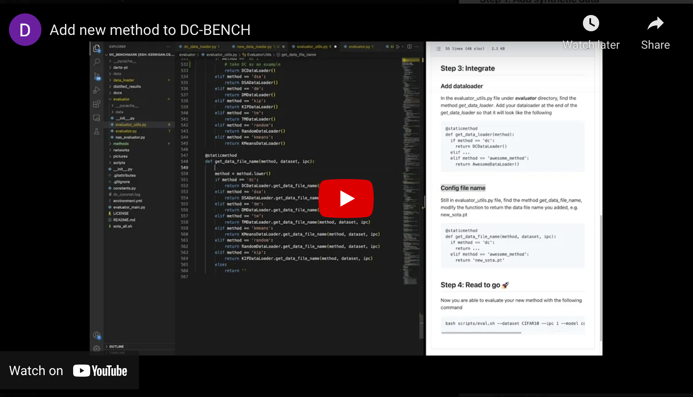

This is the official codebase for paper DC-BENCH: [Dataset Condensation Benchmark](https://arxiv.org/abs/2207.09639).  
It covers the following:  
- Condensed Dataset
- How to set up 
- Ran an evaluation
- How to integrate
- Commands to reproduce all the SOTA methods

# Test with IDC
```
python evaluator/evaluator.py --method idc --aug idc --ipc 50 --factor 2
```
- For IDC-I, use factor 1.
- You can download condensed IDC data from [link](https://drive.google.com/drive/folders/1yh0Hf2ia4b-1edMiAr1kXCH4eUcYNfmz). 
- Currently, only CIFAR-10 and CIFAR-100 are supported. (set DATA_PATH in idc_data_loader.py)

# A quick Youtube demo for adding new methods
[](https://www.youtube.com/watch?v=GkpUGBtvkVs&list=PLa7cY2m0LvSnN47GOG7SjHlYjMZ-t2NSJ)


# Condensed Data 
We provide all condensed data [here](https://drive.google.com/drive/folders/1trp0MyUoL9QrbsdQ8w7TxgoXcMJecoyH?usp=sharing), this will be needed to reproduce the benchmark results. Please see the following sections for details on how to use the data.

# How to set up
## Step 1 
Run the following command to download the benchmark.
```
git clone git@github.com:justincui03/dc_benchmark.git
```
## Step 2
Download all(or part) of the data from [this shared link](https://drive.google.com/drive/folders/1trp0MyUoL9QrbsdQ8w7TxgoXcMJecoyH?usp=sharing) and put them under <em>distilled_results</em> folder in the project root directory.   
The project structure should look like the following:    
- dc_benchmark
  - distilled_results
    - DC
    - DSA
    - ...
  - ...

### Step 3
Run the following command to create a conda environment
```
cd dc_benchmark
conda env create -f environment.yml
```

# Run an evaluation
Running an evaluation is very simple with DCBench.  
Simply run the following command from the project root director you just downloaded.
```
bash scripts/eval.sh --dataset CIFAR10 --ipc 1 --model convnet --aug autoaug
```
Here are the configurable parameters
- dataset: choose between CIFAR10, CIFAR100 and tinyimagenet
- ipc: choose between 1, 10 and 50
- model: choose between convnet, convnet4, mlp, resnet18, resnet152, etc
- aug: choose between autoaug, randaug, imagenet_aug, dsa,etc

# Neural Architecture Search
We incorparete the standard NAS-Bench-201 library into our codebase.
You can start a simple NAS experiment by running the following command
```
cd darts-pt
bash darts-201.sh --dc_method tm
```
- dc_method: which dataset condensation method to test, choose between random, kmeans-emb, dc, dsa, dm, tm

For the detailed setup, please refer to [DARTS-PT
](https://github.com/ruocwang/darts-pt)

# How to integrate
**DC-Bench** is designed to be extensible. In the following sections, we will introduce how to integrate new methods and introduce new datasets which can be as simple as a few lines of code. 
## Integrate a new method
A new method can be introduced in the following 3 steps:
- Define a new dataloader(if not already exist)
- Config the code to use the new dataloader
- Run the eval command same as all other methods

A detailed tutorial can be found [**new method integration**](docs/new_method.md)


## Introduce a new dataset
Introducing a new dataset is even easier, it can be done in the following 2 steps:  
- Extend the code to read from the new dataset(if the dataset is not already included in pytorch)
- Run the eval command by specifying the new dataset

A detailed tutorial can be found [**new dataset integration**](docs/new_dataset.md)

## Introduce new augmentations
Adding new augmentations can be done with one line of code, e.g.
```
data_transforms = transforms.Compose([transforms.RandAugment(num_ops=1)])
```
More details can be found at [**new aug integration**](docs/new_aug.md)


## Introduce new models
With DC-Bench's modularized design, it's also easy to introduce new models for evaluation.

As long as the new model follows the standard PyTorch interface[nn.Module](https://pytorch.org/docs/stable/generated/torch.nn.Module.html), you can intergare with model with the following example code
```
if model_name == 'mlp':
  return MLP(channel, num_classes, im_size)
```
Detailed instructions can be found at [**new model integration**](docs/new_model.md)

# SOTA commands
We collected all the commands to reproduce the SOTA synthetic results in our codebase. All the parameters are provided by the original authors.   
- Commands for [DC](methods/dc/readme.md)
- Commands for [DSA](methods/dc/readme.md)
- Commands for [DM](methods/dc/readme.md)
- Commands for [TM](methods/tm/readme.md)


# Example condensed datasets
|| |
|:--:|:--:|
|*Randomly selected images* | *Kmeans-emb selected images* |
| | |
|*Synthetic images by DC* | *Synthetic images by DSA* |
| ||
|*Synthetic images by DM* | *Synthetic images by TM* |

# Acknowledgments

Part of our code are adpoted from the following github repositories with license
- [DatasetCondensation](https://github.com/VICO-UoE/DatasetCondensation)
- [mtt-distillation](https://github.com/GeorgeCazenavette/mtt-distillation)
- [DARTS-PT](https://github.com/ruocwang/darts-pt)
- [vit-pytorch](https://github.com/lucidrains/vit-pytorch)

# Citation
```
@article{cui2022dc,
  title={DC-BENCH: Dataset Condensation Benchmark},
  author={Cui, Justin and Wang, Ruochen and Si, Si and Hsieh, Cho-Jui},
  journal={arXiv preprint arXiv:2207.09639},
  year={2022}
}
```
